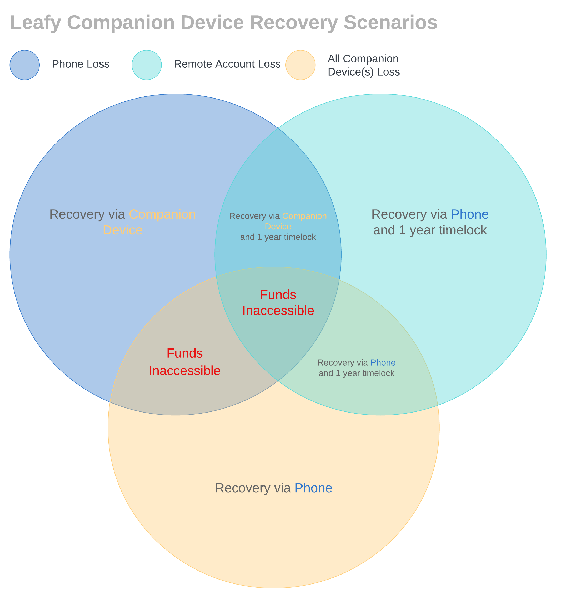
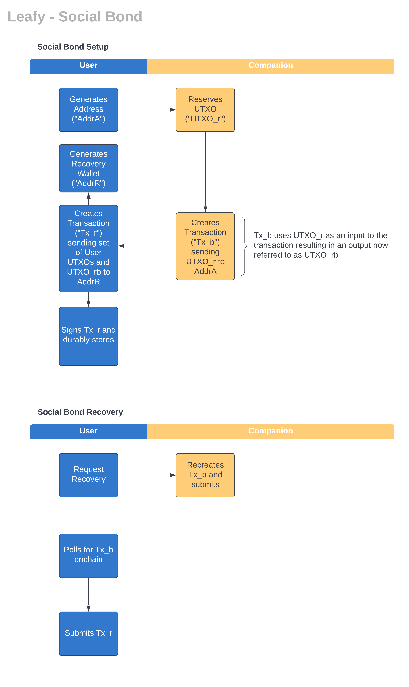

# Leafy 🌿

Leafy is a Bitcoin wallet designed to be user-friendly. It is built for those who want to participate in Bitcoin via [self-custody](#self-custody) but do not want to undertake the learning curve, cost and hassle required by other solutions.

### Getting Started

Users should download the Leafy application (available on [Android]() and [Apple]()) which will guide them through their wallet [setup](#setup).

### Leafy Goals

* **Easy** - Leafy creates interactions which are familiar to users, matching expectations from their other applications. Users need not understand Bitcoin technicalities to interact with the application.
* **Serverless** - Leafy has no servers. All components and data of Leafy are controlled by the user. 
* **Self-custodial** - Leafy provides complete control of users' bitcoin to the users themselves.
* **Recoverable** - Leafy is robust to multiple types of disaster scenarios. It optimizes for ease of recovery for common user loss scenarios (e.g. user loses phone).
* **Secure** - Leafy utilizes best practices and multiple Bitcoin primitives to secure users' funds.
* **Elastic** - Leafy is built to allow for simple onboarding of users to Bitcoin but then scales in features as the user learns more about the Bitcoin ecosystem.
* **(optionally) Social** - Leafy provides services (like [wallet recovery](#social-recovery) and [bitcoin trading](#TBD)) via the help of a users' trusted set of social companions.

### Setup

The Leafy setup is short and the user is guided through the process within the application. Below is a video demonstrating a setup.

  

### Wallet Spending

To spend bitcoin stored in a Leafy wallet, the user needs access to its Remote Account as well as the data stored on its Phone[^1]. Accessing this data within the mobile application is intuitive and familiar for a user. Below is a video demonstrating a spend.
[^1]: Funds can still be accessed if either of the user's Phone or Remote Account is inaccessible (see [Recovery](#2-recovery))

  

  

## Contents

1. [Overview](#leafy-)
2. [What is Required](#what-is-required)
3. [Advanced Topics](#advanced-topics)
4. [Technical Details](#technical-details)
5. [Terminology](#terminology)
6. [Open Source](#open-source)
7. [Roadmap](#roadmap)

## What Is Required

* Phone Application ("Phone") - users will need the Leafy application (available on [Android]() and [Apple]()).
* Remote Account ("Remote Account") - users will need an implementation of the [Remote Module](#remote-module). By default, this is a Google Drive account.
* Recovery Method ("Recovery Method") - users will need to select and configure an implementation of the [Recovery Module](#recovery-module). By default, this is a [Companion Device](#2a-companion-device-recovery).

## Advanced Topics

1. [Module System](#1-module-system)
2. [Recovery](#2-recovery)
    * [Companion Device Recovery](#2a-companion-device-recovery)
    * [Social Bond Recovery](#2b-social-bond-recovery)
3. [Optional Password/Passphrase](#3-optional-passwordpassphrase)
4. [Additional Recovery Scenarios](#4-additional-recovery-scenarios)
5. [Limitations of Recovery Scenarios](#5-limitations-of-recovery-scenarios)
6. [Bitcoin Network Connectivity](#6-bitcoin-network-connectivity)

### 1. Module System

Leafy is designed with modularity in mind. Specifically there are two modules; a [Remote Module](#remote-module) and a [Recovery Module](#recovery-module). Each module is defined by an API to allow for other developers/users to create different implementations of the module. Leafy comes with at least one implementation of each module[^2].
[^2]: ✅ represents the default implementation.

#### Remote Module

As described in [Technical Details](#technical-details), a Leafy wallet requires two [BIP-39](https://github.com/bitcoin/bips/blob/master/bip-0039.mediawiki) seed phrases. One of these phrases is stored on the user's Phone and another within a Remote Account. The Remote Module is the API necessary to implement a Remote Account. It is defined [here](TBD). 

Here are the Remote Accounts supported or being developed by Leafy.

| Remote Account | Description                                                                                                                                                                                                                                                                                                                                                                                                                                                                                                                                                                                                                                    |       Status |
|:---------------|:-----------------------------------------------------------------------------------------------------------------------------------------------------------------------------------------------------------------------------------------------------------------------------------------------------------------------------------------------------------------------------------------------------------------------------------------------------------------------------------------------------------------------------------------------------------------------------------------------------------------------------------------------|-------------:|
| Google Drive ✅ | Implemented via the [Google Drive API](https://developers.google.com/drive/api/guides/about-sdk) as well as the user [Google Drive application storage](https://developers.google.com/drive/api/guides/appdata)                                                                                                                                                                                                                                                                                                                                                                                                                                | Supported 💪 |
| Apple iCloud   | Implemented via [Apple's iCloud key storage](https://developer.apple.com/library/archive/documentation/General/Conceptual/iCloudDesignGuide/Chapters/DesigningForKey-ValueDataIniCloud.html)                                                                                                                                                                                                                                                                                                                                                                                                                                                   |   Planned 🚧 |
| Hardware       | Like [ColdCard](https://coldcard.com/) or [Ledger](https://www.ledger.com/)                                                                                                                                                                                                                                                                                                                                                                                                                                                                                                                                                                    |  Research 🔬 |
| On-chain       | Could be implemented in at least three ways with various trade-offs. Each would require encryption given the public nature of the blockchain.<table><tr><th></th><th>[Inscription](https://docs.ordinals.com/guides/inscriptions.html)</th><th>[Stamps](https://github.com/mikeinspace/stamps/blob/main/BitcoinStamps.md)</th><th>[Annex](https://github.com/bitcoin/bips/blob/master/bip-0341.mediawiki#script-validation-rules)</th></tr><tr><td>Transactions Needed</td><td>2</td><td>1</td><td>1</td></tr><tr><td>Standard</td><td>✅</td><td>✅</td><td>⛔</td></tr><tr><td>Witness Discount</td><td>✅</td><td>⛔</td><td>✅</td></tr></table> |  Research 🔬 |

#### Recovery Module

To assist a user in recovering their Leafy wallet in case of various loss scenarios, the user must select and configure a Recovery Module implementation. The Recovery Module is the API necessary to implement a Recovery Method. It is defined [here](TBD).

Here are the Recovery Methods supported or being developed by Leafy.

| Recovery Method    | Description                                                                                                                                                                                         |       Status |
|:-------------------|:----------------------------------------------------------------------------------------------------------------------------------------------------------------------------------------------------|-------------:|
| Companion Device ✅ | Leverages trusted companions to store backups of a user's seed phrase and timelocks to recover from Remote Account access loss. This is [defined in depth below](#2a-companion-device-recovery).    | Supported 💪 |
| Social Bond        | Leverages trusted companions to pledge a [UTXO](https://river.com/learn/bitcoins-utxo-model/) to aid in recovery of a user's UTXO set. This is [discussed further below](#2b-social-bond-recovery). |  Research 🔬 |

Continue to [Recovery](#2-recovery) for more details about each and to see a [comparison](#2c-companion-device-and-social-bond-comparison) between the two.

### 2. Recovery

As detailed in [What Is Required](#what-is-required), a user needs to configure a [Recovery Module](#recovery-module). Currently, there is one implementation of recovery, the [Companion Device Recovery](#2a-companion-device-recovery) and another, [Social Bond Recovery](#2b-social-bond-recovery), being researched as a potential implementation.

#### 2.a Companion Device Recovery

If using the companion device recovery module, users will be required to utilize a secondary device ("Companion Device"). The Companion Device could be a friend's, see [Social Recovery](#social-recovery), or their own, see [Anti-Social Recovery](#anti-social-recovery). The user needs at least one Companion Device but can configure multiple. In normal usage, Leafy functions with the combination of the data on the Phone and the Remote Account. The Companion Device is added to easily facilitate recovery from the most common loss scenario which is a user losing its Phone.

##### Social Recovery

The recommended way to setup a Companion Device is to enlist the support of a friend, family member or someone else trusted by the user. This companion will install the Leafy application on their Phone and the application will facilitate the backup of data to be used in the event of the user losing access to its Phone. A user can choose one or more Companion Devices to facilitate in recovery operations.

##### Anti-Social Recovery

In the event a user has no trusted social contacts, the user can employ an anti-social strategy for recovery. It requires the use of a second, independent, phone and remote account. Using this secondary phone as the Companion Device the user can back up the data from its primary Phone. Note, given the secondary nature of the phone and remote account the Anti-Social Recovery is not recommended as it requires a further burden on the user.  For instance, it is easier to lose access to a less often used secondary account as well as forget to perform proper maintenance on a secondary device (e.g. security updates).

##### Non-Loss Recovery Scenarios

There are some common scenarios requiring recovery which are not the result of a lost phone. These are detailed below.

###### New Phone

If the user gets a new phone and is still in possession of its existing Phone, the existing Phone can be used like a Companion Device to transfer relevant data to the new phone. Of course, the user can, if desired, use one of its other [Companion Device(s) for recovery](#2a-companion-device-recovery).

###### Uninstall Application / Application Data Deleted

If the user uninstalls the Leafy application or the application data stored locally is deleted, the user's quickest path to recovery is to leverage its [Companion Device(s) for recovery](#2a-companion-device-recovery).

##### Timelock for Recovery

To deal with less common loss scenarios, Leafy leverages an aspect of the Bitcoin network called "timelocks" (more details on timelocks are documented in [Technical Details](#technical-details)). Timelocks allow for recovery in unlikely events without needing to trust a third-party service or arbitrator (inline with [Leafy's goal of **Serverless**](#leafy-goals)). Mechanically, this works by relaxing the spend conditions of the Leafy wallet after a period of time has expired (this time period is the "timelock" and it is enforced directly by the Bitcoin network). Using a timelock, the user can recover from losing access to its Remote Account. The timelock selected is 1 year. The selection of 1 year can be revisited with actual user data/experiences but is selected currently as a balance between the assumed likelihood of users losing access to their Remote Account versus the need to perform a [Liveliness Check](#liveliness-check).

##### Companion Device Recovery Summary

The following image diagrams how recovery is handled for all possible combinations of loss in the Companion Device Recovery module. An important insight from this diagram is that user funds can be recovered for most combinations of loss. There is one scenario which results in a user not being able to access its funds: if the user losses its Phone and all its Companion Devices at the same time. Note, in this scenario access to the Remote Account does not assist in recovery and so additionally losing access to the Remote Account is outcome equivalent.

  

##### Liveliness Check

As discussed in [Timelock for Recovery](#timelock-for-recovery), funds are encumbered with timelocks to aid in certain recovery scenarios when utilizing Companion Device Recovery. In the normal usage of a Leafy wallet (when the user maintains access to its Phone and Remote Account), these timelock paths will not be necessary. To maintain the security of needing both Phone and Remote Account to send bitcoin, each deposit into a Leafy wallet should be "refreshed" prior to the timelock expiry. This refresh is a sending of the bitcoin to another address controlled by the user. The Leafy application will assist the user in this liveliness check, making the process easy, quick and as cheap as possible. The Leafy application will remind the user about 1 month before the timelock expiry. This allows the user to attempt a low-fee transaction with enough time to increase fees prior to expiry.

Although this liveliness check incurs on-chain transactions/fees, it has positive externalities as well. For instance, it is a form of key rotation which is a recommended part of key management in [NIST SP 800-57](https://csrc.nist.gov/pubs/sp/800/57/pt1/r5/final). It also acts as a yearly proof of control for a user over the entirety of their assets.

#### 2.b Social Bond Recovery

> [!WARNING]
> Social Bond Recovery is actively being researched as a viable Recovery Method for Leafy wallets but is not yet supported.

If using the social bond recovery module, users must enlist the support of a friend, family member or someone else trusted and willing to pledge a small portion of their bitcoin (called a [UTXO](https://river.com/learn/bitcoins-utxo-model/)) to assist the user in the event of recovery. This pledged UTXO is referred to as the "social bond". The idea behind social bond recovery is to preallocate movement of the user funds to a recovery wallet but ensure this movement is only valid if the social bond is executed. This helps ensure the preallocated movement is only executed in actual user initiated recovery scenarios.

  

The social bond recovery method is cheap to maintain (as opposed to [Companion Device](#2a-companion-device-recovery) which requires yearly [liveliness checks](#liveliness-check)) in that the "social bond" UTXOs can be refreshed on demand without incurring on-chain fees (no on-chain transactions required).

##### Fee Handling

TODO

##### Bond Payment

TODO

##### Recovery Wallet Options/Selection

TODO

##### Preallocated Transaction Durability

TODO

##### Non-Loss Recovery Scenarios

There are some common scenarios requiring recovery which are not the result of a lost phone. These are detailed below.

###### New Phone

TODO

###### Uninstall Application / Application Data Deleted

TODO

##### Social Bond Recovery Summary

TODO

#### 2.c Companion Device and Social Bond Comparison

|                                        | [Companion Device](#2a-companion-device-recovery) | [Social Bond](#2b-social-bond-recovery) |
|:---------------------------------------|--------------------------------------------------:|----------------------------------------:|
| **Yearly Maintenance Transactions**    |                                             1[^3] |                                       0 |
| **First Seed Recovery Transactions**   |                                                 0 |                                       2 |
| **Second Seed Recovery Transactions**  |                                                 1 |                                       2 |
| **Wait Time for First Seed Recovery**  |                                                 0 |                                 1 block |
| **Wait Time for Second Seed Recovery** |                           1 ≤ wait < 52560 blocks |                                1 block  |

[^3]: This is the [liveliness checks](#liveliness-check) requirement

**Note** the value `1` for Companion Device is technically `T + F` and the value of `2` for Social Bond is technically `1 + T + F`[^4]. For this analysis it is assumed that `U` can fit entirely within `1` transaction and that transaction can pay for fees. The UTXOs are P2TR inputs where there need only be 2 outputs for the transaction. Over [17,000 inputs could fit within a 1 vMB transaction](https://bitcoinops.org/en/tools/calc-size/) and we'll assume Leafy users have less than this number of UTXOs.
[^4]: The additional `1` is the social bond transaction (`Tx_b` in the [social bond diagram](#2b-social-bond-recovery))

| Symbol | Definition                                                      |
|:-------|:----------------------------------------------------------------|
| `U`    | User UTXO count                                                 |
| `F`    | Number of fee transactions                                      |
| `T`    | Minimum number of transactions to contain `U` Note, `T < U` | 

> [!NOTE]
> For the rest of the document, it is assumed that the Recovery Method is the [Companion Device Recovery](#2a-companion-device-recovery). If the [Social Bond Recovery](#2b-social-bond-recovery) becomes viable, the documentation will be revised to distinguish between the two methods and highlight different treatment depending upon the Recovery Method used by the user.

***

### 3. Optional Password/Passphrase

A primary goal of Leafy is to create an easy-to-use application for non-technical users. This is the main rationale for not requiring (nor recommending) the user secure any portion of its wallet with a password/passphrase. However, there are several reasons why utilizing a password/passphrase would be beneficial to a user.

| Scenario                      | Description                                                                                                                                                                                                                                                                                                                                                                                                                           |
|:------------------------------|:--------------------------------------------------------------------------------------------------------------------------------------------------------------------------------------------------------------------------------------------------------------------------------------------------------------------------------------------------------------------------------------------------------------------------------------|
| Wallet Address Privacy        | Without a password/passphrase the addresses (for technical details see [Descriptors](#descriptor-storage) below) of the user's wallet can be determined by a malicious Companion Device. This would allow the malicious party to view the user's addresses and transactions. However, if the user elects a password/passphrase, even a malicious Companion Device is unable to view the user's wallet addresses and transactions. |
| Malicious Companion Device(s) | Described in section [Malicious Companion Device(s)](#malicious-companion-devices).                                                                                                                                                                                                                                                                                                                                                   |

Leafy acknowledges that some users may desire stronger privacy and a stronger guarantee of security even in exotic scenarios. Given this, Leafy does support an optional password/passphrase that the user can configure on setup. This is not recommended though given the burden it places on the user. Leafy assumes the average user will not be concerned with the scenarios a password/passphrase mitigates. In fact, requiring a user to remember a password/passphrase may cause more harm as the funds would be inaccessible in certain recovery scenarios if the user forgets its chosen password/passphrase.

### 4. Additional Recovery Scenarios

Primary recovery scenarios are [documented above](#recovery). There are a couple of more exotic scenarios discussed here.

#### Remote Account Provider Obstruction

In the event that the Remote Account is not accessible because the remote account provider has shut-down or is restricting access to the user's account, the user's recourse is the same as if the user lost access to the account which is to leverage [Timelock for Recovery](#timelock-for-recovery).

#### App Provider Obstruction

In the event either App Provider ([Google Play Store](https://play.google.com/) or [Apple App Store](https://www.apple.com/app-store/)) removes the application from its store the user can attempt recovery by utilizing a different phone of the other App Provider. If the user is unable or unwilling to use a different App Provider or if both App Providers have removed the application, the user can still use the Leafy application provided the user still has the application installed on its Phone. Otherwise, if the user has happened to uninstall the application before the App Provider has removed the application from its store, the user can rely upon its Companion Device(s) hoping at least one of them has the application still installed. In the event neither the user nor its Companion Device(s) are accessible, this scenario amounts to [Timelock for Recovery](#timelock-for-recovery) with an additional obstacle that the user is unable to utilize the Leafy mobile application for recovery. To mitigate this, Leafy [posts binaries](TBD), APK (Android) and IPA (iOS), for each release to allow a user to ["side load" the application](https://en.wikipedia.org/wiki/Sideloading) on its (or another) phone. In case the user is unable or unwilling to utilize side-loading of the mobile application, Leafy also [posts separate binaries](TBD) for Windows/MacOS/Linux. These binaries are single-focused applications to assist in this recovery scenario.

Both the [side-loaded binaries](TBD) and the [separate binaries](TBD) include instructions on content verification as well as installation.

### 5. Limitations of Recovery Scenarios

As outlined above, users have the ability to recover from many loss scenarios. This can even include obstruction by [remote account providers](#remote-account-provider-obstruction) and [app providers](#app-provider-obstruction). However, there are certain scenarios where the user has no recourse. These are discussed below.

#### Simultaneous Loss of Phone and all Companion Device(s)

As visualized in [Companion Device Recovery Summary](#companion-device-recovery-summary), if the user simultaneously losses access to its Phone as well as all Companion Device(s) there is no recourse for the user. Provided there has been no theft of these devices (or [malicious Companion Device(s)](#malicious-companion-devices)) the funds are not accessible but also are not stolen. This means that if the user can regain access to either its existing Phone or any of its Companion Device(s), the funds can still be recovered.

#### Malicious Companion Device(s)

In the case that one or all of the Companion Device(s) is malicious ("MCD") there are scenarios in which the user cannot recover.  In the table below "Pwd" represents a [user electing to use a password/passphrase](#optional-passwordpassphrase) during setup.

| Case                                         |                                                                                                                 Result                                                                                                                  | Description                                                                                                                                                                                                                                                                                                                                                                                                                                                                                                                                                                                                                                                                                                          |
|:---------------------------------------------|:---------------------------------------------------------------------------------------------------------------------------------------------------------------------------------------------------------------------------------------:|:---------------------------------------------------------------------------------------------------------------------------------------------------------------------------------------------------------------------------------------------------------------------------------------------------------------------------------------------------------------------------------------------------------------------------------------------------------------------------------------------------------------------------------------------------------------------------------------------------------------------------------------------------------------------------------------------------------------------|
| Normal                                       |                                                                                                       🟩                                                                                                                                | User funds are safe from MCD(s) as the user will perform [liveliness checks](#liveliness-check) which move the funds to new timelock addresses                                                                                                                                                                                                                                                                                                                                                                                                                                                                                                                                                                       |
| Missed [Liveliness Check](#liveliness-check) |                                                                           <table><tr><th>Pwd</th><th>No Pwd</th></tr><tr><td>🟩</td><td>🟥</td></tr></table>                                                                            | Unless the user has configured a password/passphrase, a single MCD can now steal funds but is in competition with the user to confirm its theft-transaction prior to the user confirming a competing transaction.                                                                                                                                                                                                                                                                                                                                                                                                                                                                                                    |
| Lost Phone                                   | Risk of Theft <table><tr><th>Pwd</th><th>No Pwd</th></tr><tr><td>🟩 🟩</td><td>🟩 🟥</td></tr></table> Risk of DoS <table><tr><th>Pwd</th><th>No Pwd</th></tr><tr><td>🟩 🟥</td><td>🟩 🟥</td></tr></table> | **Risk of Theft** Unless the user has configured a password/passphrase, the outcome for the user depends upon whether there is at least one honest Companion Device. <table><tr><th/><th>Pwd</th><th>No Pwd</th></tr><tr><td>One Honest</td><td>🟩</td><td>🟩</td></tr><tr><td>All MCDs</td><td>🟩</td><td>🟥</td></tr></table> **Risk of Denial of Service ("DoS")** Regardless of whether a user has configured a password/passphrase, the outcome for the user depends upon whether there is at least one honest Companion Device. <table><tr><th/><th>Pwd</th><th>No Pwd</th></tr><tr><td>One Honest</td><td>🟩</td><td>🟩</td></tr><tr><td>All MCDs</td><td>🟥</td><td>🟥</td></tr></table> |

This scenario highlights the following three recommendations:
1. Use more than one Companion Device
2. Only select highly trusted individuals to use as Companion Devices
3. Always promptly perform [liveliness checks](#liveliness-check)

Additionally, for those users requiring extra assurance, [electing to use a password/passphrase](#optional-passwordpassphrase) will prevent theft in the case of malicious Companion Device(s).

***

### 6. Bitcoin Network Connectivity

Leafy does not **require** users to [run a full bitcoin node](https://river.com/learn/how-to-run-a-bitcoin-node/). This is purposefully done to ease onboarding and the burden on the user when using the application. For connectivity to the Bitcoin network, Leafy leverages the open source [mempool.space APIs](https://mempool.space/docs/api/rest).

#### Customizable Bitcoin Network Connectivity

For those interested, Leafy makes it easy to "upgrade" a user's usage of Leafy to control how the application accesses the Bitcoin network. Leafy does this by allowing the user to modify the mempool.space API URL used by the application. This allows the user to run a self-hosted/local version of the open source mempool.space application (mempool.space [documents this process](https://github.com/mempool/mempool/tree/master/docker)) in conjunction with their own full bitcoin node. This optional configuration allows for better [self-sovereignty](#self-sovereign) of the user's bitcoin.

## Technical Details

The following information is not required to be understood by users. It is documentation for anyone curious to learn more.  The primary source of documentation is the [source code](https://github.com/blangel/leafy) itself.

### How It Works

Each Leafy wallet is composed of two [BIP-39](https://github.com/bitcoin/bips/blob/master/bip-0039.mediawiki) seed phrases with 128-bits of entropy ("First Seed", "Second Seed"). The user's bitcoin is stored encumbered with [SegWit v1 ("P2TR"/"Taproot")](https://river.com/learn/terms/p/pay-to-taproot-p2tr/) addresses.  Each P2TR address is spendable via an [internal key](https://en.bitcoin.it/wiki/BIP_0341) which is the composition of First Seed and Second Seed as well as one tapscript leaf path. The tapscript leaf path is a [CheckSequenceVerify ("CSV") timelock](https://en.bitcoin.it/wiki/Timelock#CheckSequenceVerify) of First Seed for 52560 blocks (approximately one year).

### Key Composition

Below details the composition of the internal key and the tapscript path for each Leafy address.

#### Internal Key (used in normal usage)

The internal key is composed of a [BIP-32](https://github.com/bitcoin/bips/blob/master/bip-0032.mediawiki) derivation (derivation paths start at `44'/0'/0'/0/x` where `x` is 0 and then monotonically increases) of the Second Seed tweaked via a hash of the First Seed at the same derivation.

#### Script Path Spend (used in recovery of Second Seed loss)

The script path spend is encumbered by the following script (`<first_key> OP_CHECKSIGVERIFY <50cd00> OP_CHECKSEQUENCEVERIFY` created from [miniscript](https://bitcoin.sipa.be/miniscript/) `and_v(v:pk(first_key),older(52560))`) where `first_key` is First Seed at the same derivation as the internal key.

#### Key Composition Summary

| Component     | Usage    | Encumbrance                             |
|---------------|----------|-----------------------------------------|
| Internal Key  | Normal   | First Seed & Second Seed                |
| 1st TapScript | Recovery | First Seed & 52560 Timelock             |

### Storage

Leafy requires durable storage of three pieces of information. First Seed, Second Seed and Second Seed [Descriptor](https://github.com/bitcoin/bitcoin/blob/master/doc/descriptors.md). The Descriptor is only the extended public keys for the Second Seed.

#### First Seed Storage

The First Seed is stored encrypted within the user's device (via the [secure_storage](https://pub.dev/packages/flutter_secure_storage) library). To facilitate recovery scenarios, this data is also stored on one or more Companion Device(s). On the Companion Device the data is stored encrypted (via the [secure_storage](https://pub.dev/packages/flutter_secure_storage) library) as well as encrypted (via the companion's own First Seed's public key) on the companion's associated Remote Account. If the user has [elected to use a password/passphrase](#optional-passwordpassphrase), the data is first encrypted via the password/passphrase using [Fernet encryption](https://cryptography.io/en/latest/fernet/) before being given to the Companion Device(s).

#### Second Seed Storage

The Second Seed is encrypted with the First Seed using [Fernet encryption](https://cryptography.io/en/latest/fernet/). This is then stored within the user's Remote Account.  If an attacker has access to the user's Remote Account (or if the remote account provider itself has access) the data stored is encrypted and requires the First Seed to decrypt. Furthermore, if the user losses access to its Remote Account the user still has recourse to recover funds (see [Recovery](#recovery) above).

#### Descriptor Storage

The Second Seed Descriptor is stored encrypted within the user's device (via the [secure_storage](https://pub.dev/packages/flutter_secure_storage) library). To facilitate recovery scenarios, this data is also stored on one or more Companion Device(s). On the Companion Device the data is stored encrypted (via the [secure_storage](https://pub.dev/packages/flutter_secure_storage) library) as well as encrypted (via the companion's own First Seed's public key) on the companion's associated Remote Account. If the user has [elected to use a password/passphrase](#optional-passwordpassphrase), the data is first encrypted via the password/passphrase using [Fernet encryption](https://cryptography.io/en/latest/fernet/) before being given to the Companion Device(s).

#### Storage Summary

In the table, `[Pwd]` represents the optional password/passphrase. If elected by the user, the data is first encrypted with this password/passphrase and then encrypted by the indicated encryption method.

| Data        | Location                       | Encryption                                                                    |
|:------------|:-------------------------------|:------------------------------------------------------------------------------|
| First Seed  | Phone                          | [secure_storage](https://pub.dev/packages/flutter_secure_storage)             |
|             | Companion Device(1..n)         | `[Pwd]` [secure_storage](https://pub.dev/packages/flutter_secure_storage)     |
|             | Companion Remote Account(1..n) | `[Pwd]` Companion's `First Seed` Public Key                                   |
| Second Seed | Remote Account                 | First Seed                                                                    |
| Descriptor  | Phone                          | [secure_storage](https://pub.dev/packages/flutter_secure_storage)             |
|             | Companion Device(1..n)         | `[Pwd]` [secure_storage](https://pub.dev/packages/flutter_secure_storage)     |
|             | Companion Remote Account(1..n) | `[Pwd]` Companion's `First Seed` Public Key                                   |

## Terminology

### Self Custody

Self custody is the process and tools allowing a user to solely control the responsibility of securing the bitcoin the user financially owns. Typically, bitcoin is encumbered via a locking script which only requires the possession of a private key. Often self-custody is synonymous with possession of a private key. However, bitcoin can be encumbered in simpler as well as more complicated ways than a single private key (e.g. set of private keys, preimages, etc). To be self-custodial the user must take responsibility for the full encumbrance of their bitcoin.

### Self Sovereign

Leafy views bitcoin ownership as an evolution towards self-sovereignty. Self-sovereignty is a superset of self-custody. Besides self-custody, it also includes user control over [Bitcoin network connectivity](#customizable-bitcoin-network-connectivity) as well as the ability to freely [exchange bitcoin](#TBD) with others.

## Open Source

Leafy ("program"), like Bitcoin ("money"), is [open-source](https://github.com/blangel/leafy) because ["If the users don't control the program, the program controls the users."](https://www.gnu.org/philosophy/free-software-even-more-important.html).

## Roadmap

TBD